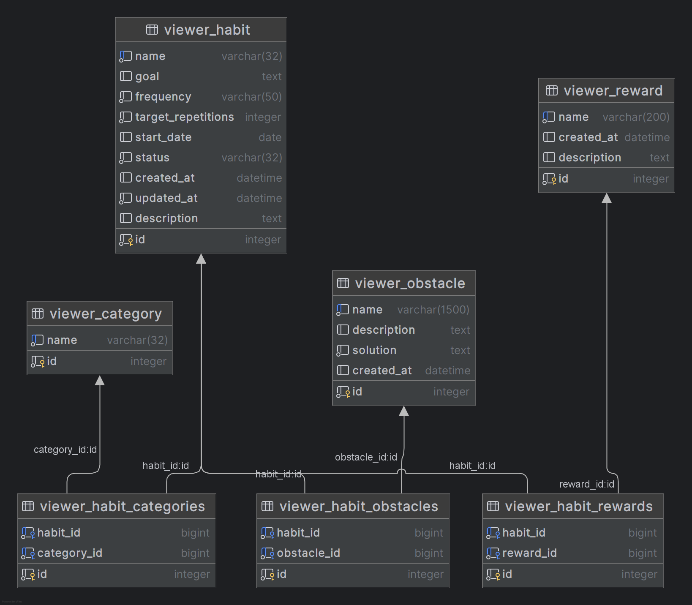
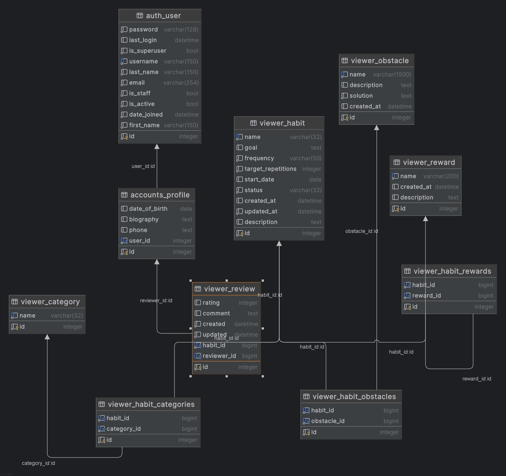
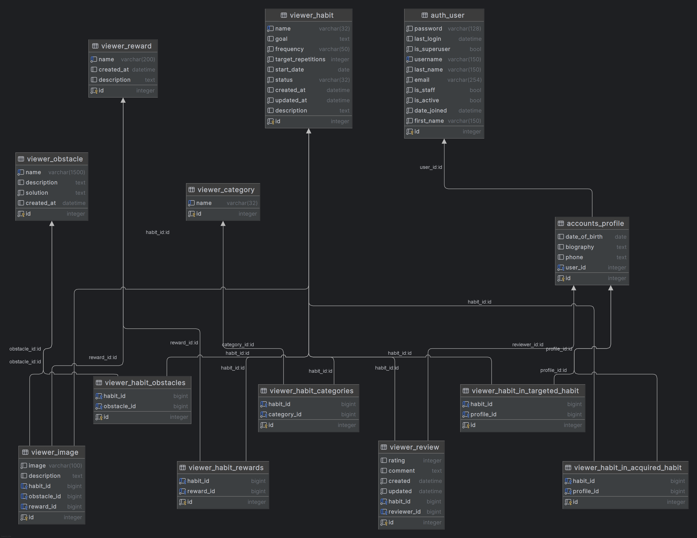

# POPIS PROJEKTU 

# Zobrazení
1. zobrazit seznam návyků
2. zobrazit detail návyku
3. zobrazit seznam kategorií návyků
4. zobrazit seznam překážek návyků
5. zobrazit seznam odměn za plnění
6. zobrazit komentář k návyku
7. zobrazit obrázek k návyku
8. zobrazit počasí
9. zobrazit svátek

# Přidávání
1. přidat návyk
2. přidat překážku
3. přidat odměnu
4. přidat komentář

# Mazání
1. smazat návyk
2. smazat pčekážku
3. smazat odměnu

# Upravování
1. upravit návyk
2. upravit překážu
3. upravit odměnu

# Filtrování návyků
1. podle názvu
2. podle kategorie
3. podle překážky
4. podle odměny

# Hledání
1. názvu
2. kategorie
3. překážky
4. odměny

# Obrázek databáze

# Databáze
- [x] Category
  - [x] name

- [x] Obstacle
  - [x] name (string)
  - [x] description (string)
  - [x] solution (string)
  - [x] created_at (datetime)

- [x] Reward
  - [x] name (string)
  - [x] description (string)
  - [x] created_at (datetime)

- [x] Habit 
  - [x] categories (string)
  - [x] name (string)
  - [x] obstacles (string)
  - [x] rewards (string)
  - [x] goal (string)
  - [x] frequency (string)
  - [x] target_repetitions (integer)
  - [x] start_date (datetime)
  - [x] status (string)
  - [x] created_at (datetime)
  - [x] updated_at (datetime)
  - [x] description (string)
  - [x] rating (float)
  - [x] images (image)
  - [x] in_acquired_habit (n:m -> Profile)
  - [x] in_targeted_habit (n:m -> Profile)

- [x] Review
  - [x] habit (string)
  - [x] reviewer (string)
  - [x] rating (integer)
  - [x] comment (string)
  - [x] created (datetime)
  - [x] updated (datetime)
  

- [x] Image
  - [x] image
  - [x] habit (string)
  - [x] description (string)

- [x] User (django_default)

- [x] Profile
  - [x] user (string)
  - [x] date_of_birth (datetime)
  - [x] biography (string)
  - [x] phone (integer)

  

